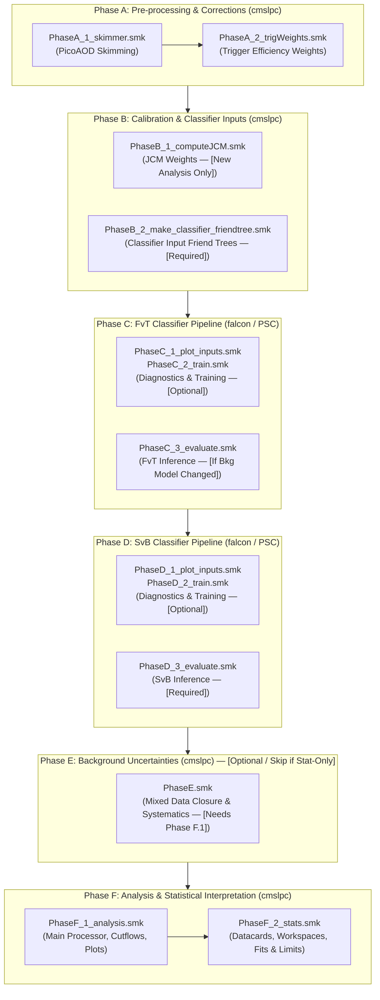

# Coffea4bees Analysis Workflows

This directory contains the Snakemake workflows orchestrated for the **HH $\to$ 4b** (and **ttH(bb)**) analysis pipelines in `coffea4bees`.

The pipeline is organized into modular **Phases (A through F)** reflecting the full analysis lifecycle, from raw nanoAOD ntuples to final Combine statistical interpretation and limit extraction.

---

## 1. Execution Environments & Target Machines

| Phase | Purpose | Target Execution Environment | Compute Requirements |
| :--- | :--- | :--- | :--- |
| **Phase A** | Skimmer & Trigger Weights | **`cmslpc`** | CPU (Condor / Dask batching) |
| **Phase B** | **Phase B.1**: Compute JCM *(New Analysis Only)*<br>**Phase B.2**: Make Classifier Friend Trees *(Required)* | **`cmslpc`** | CPU (Condor / Dask batching) |
| **Phase C** | **Phase C.1 / C.2**: Plot Inputs & Train *(Optional)*<br>**Phase C.3**: Evaluate *(If Bkg Model Changed)* | **`falcon`** (GPU cluster) / **PSC Bridges-2** | GPU (NVIDIA MPS/CUDA for training & inference) |
| **Phase D** | **Phase D.1 / D.2**: Plot Inputs & Train *(Optional)*<br>**Phase D.3**: Evaluate *(Required)* | **`falcon`** (GPU cluster) / **PSC Bridges-2** | GPU (NVIDIA MPS/CUDA for training & inference) |
| **Phase E** | Background Uncertainties & Closure *(Optional — Skip if Stat-Only; Requires Phase F.1 Singlefiles)* | **`cmslpc`** | CPU (Condor / Dask batching) |
| **Phase F** | Analysis Processor & CMS Combine Stats | **`cmslpc`** | CPU (Condor + Dask + Combine container) |

> [!TIP]
> **Configuration Best Practice**: While Snakemake supports direct command-line parameter overrides (e.g. `--config dataset=ttHbb year=UL18`), the **recommended and reproducible approach** is to run workflows using a centralized YAML configuration file passed via `--configfile` (e.g. `--configfile coffea4bees/workflows/config/nominal_run2.yml` or `coffea4bees/workflows/config/analysis_ttHbb.yml`). CLI `--config` flags should only be used for temporary or targeted overrides (such as `--config test=true` or single-dataset evaluation).

---

## 2. High-Level Analysis Pipeline Architecture



> [!NOTE]
> *See the [Phase-by-Phase Technical Specifications](#3-phase-by-phase-technical-specification) below for detailed conditions regarding optional (one-time setup or retraining) versus routine execution steps, along with intermediate metadata updates.*

---

## 3. Phase-by-Phase Technical Specification

### Phase A: Skimming & Trigger Weights
* **Target Machine:** **`cmslpc`** (CPU batching via HTCondor)
* **Coordinator:** `Snakefile_PhaseA.smk`
* **Sub-workflows:**
  * `Snakefile_PhaseA_1_skimmer.smk`: Runs `skimmer_4b.py` on nanoAOD datasets, applies baseline object selections, and writes skimmed picoAOD root files.
  * `Snakefile_PhaseA_2_trigWeights.smk`: Calculates trigger efficiency scale factors and outputs a trigger weights friend tree JSON.

#### Key Artifacts & Required Downstream Updates:
* **After Phase A.1 (Skimmer)**:
  * *Outputs Produced*: Skimmed picoAOD ROOT files (`picoAOD_*.root`) on EOS.
  * *Files to Add/Modify*: Create or update dataset manifest files in `metadata/datasets/` (e.g. `picoaod_datasets_<analysis>.yml`) so downstream processors find the skimmed files.
* **After Phase A.2 (Trigger Weights)**:
  * *Outputs Produced*: Trigger weight friend trees and manifest `trigWeights_nominal.json` on EOS.
  * *Files to Add/Modify*: Register the trigger weight friend path in the analysis friend file (e.g. `friends_<analysis>.yml`):
    ```yaml
    trigWeight:
      - path: 'root://cmseos.fnal.gov//store/user/.../trigWeights_nominal.json'
        name: Final
    ```

#### Snakemake Rulegraph DAG:
<p align="center">
  
</p>

**Execution Examples:**
```bash
# Run full Phase A (Skim + Trigger Weights) via config file on cmslpc
./run_container snakemake -s coffea4bees/workflows/Snakefile_PhaseA.smk \
    --configfile coffea4bees/workflows/config/analysis_ttHbb.yml

# Run only the skimmer
./run_container snakemake -s coffea4bees/workflows/Snakefile_PhaseA_1_skimmer.smk \
    --configfile coffea4bees/workflows/config/analysis_ttHbb.yml

# Run only trigger weights calculation
./run_container snakemake -s coffea4bees/workflows/Snakefile_PhaseA_2_trigWeights.smk \
    --configfile coffea4bees/workflows/config/analysis_ttHbb.yml
```

---

### Phase B: Calibration & Classifier Input Preparation
* **Target Machine:** **`cmslpc`**
* **Coordinator:** `Snakefile_PhaseB.smk`
* **Sub-workflows:**
  * `Snakefile_PhaseB_1_computeJCM.smk`: **[New Analysis Only / One-Time]** Derives jet combinatoric model weights by running the Coffea processor with `apply_JCM: false` and fitting the resulting histograms to compute transfer factors between jet multiplicities. Done once when establishing a new analysis baseline, and reused thereafter.
  * `Snakefile_PhaseB_2_make_classifier_friendtree.smk`: **[Required for All Analyses]** Runs the Coffea processor (`processor_HH4b.py make_classifier_input`) on datasets to create the ROOT friend tree files used as input features for classifier training and evaluation.

#### Key Artifacts & Required Downstream Updates:
* **After Phase B.1 (computeJCM)**:
  * *Outputs Produced*: Fitted JCM YAML file (`jetCombinatoricModel_SB_<tag>.yml`).
  * *Files to Add/Modify*: Store the JCM file in `metadata/weights/JCM/<analysis>/` and update `weights_<analysis>.yml` (e.g. `weights_ttHbb.yml` or `weights_HH4b.yml`) to point `JCM_file:` to this new file.
* **After Phase B.2 (make_classifier_friendtree)**:
  * *Outputs Produced*: Classifier input friend tree ROOT files on EOS + `classifier_inputs_friends.json` manifest.
  * *Files to Add/Modify*: Create the classifier dataset manifest in `metadata/datasets/.../classifier_inputs_<analysis>.json` with the `@@HCR_input` / `@@HCR_input_lowpt` dataset configuration block for PyTorch dataloaders. Ensure `fvt.metadata` and `svb.metadata` in the master config point to this JSON.

#### Snakemake Rulegraph DAG:
<p align="center">
  
</p>

**Execution Examples (on cmslpc):**
```bash
# Run full Phase B (JCM + Classifier Inputs) on cmslpc
./run_container snakemake -s coffea4bees/workflows/Snakefile_PhaseB.smk \
    --configfile coffea4bees/workflows/config/analysis_ttHbb.yml \
    --cores 8

# Run only Phase B.1 JCM computation (New analysis only)
./run_container snakemake -s coffea4bees/workflows/Snakefile_PhaseB_1_computeJCM.smk \
    --configfile coffea4bees/workflows/config/analysis_ttHbb.yml \
    --cores 4

# Run only Phase B.2 Classifier friend tree inputs creation (All analyses)
./run_container snakemake -s coffea4bees/workflows/Snakefile_PhaseB_2_make_classifier_friendtree.smk \
    --configfile coffea4bees/workflows/config/analysis_ttHbb.yml \
    --cores 8
```

---

### Phase C: FvT (Four-vs-Three) Classifier Pipeline
* **Target Machine:** **`falcon`** (GPU cluster) or **PSC Bridges-2** (Entire Phase on GPU)
* **Coordinator:** `Snakefile_PhaseC.smk`
* **Sub-workflows:**
  * `Snakefile_PhaseC_1_plot_inputs.smk`: *(Optional / Diagnostics)* Generates raw feature distributions, preprocessed data distributions, and learned event weights plots (`plot_inputs_raw`, `plot_inputs_dataprep`, `plot_weights`).
  * `Snakefile_PhaseC_2_train.smk`: *(Optional — If Retraining FvT)* Trains multi-fold FvT neural networks using PyTorch/HCR (`train`) and produces training loss and ROC curve diagnostics (`analyze`).
  * `Snakefile_PhaseC_3_evaluate.smk`: *(Run If Background Estimation / JCM Changed)* Evaluates trained models on datasets to produce FvT friend tree ntuples (`evaluate`). Flexible to run standalone or chained after training.

#### Key Artifacts & Required Downstream Updates:
* **After Phase C.2 (Train)**:
  * *Outputs Produced*: PyTorch checkpoint weights (`model.pt`, `model_fold_*.pt`) and `result.json` on EOS.
* **After Phase C.3 (Evaluate)**:
  * *Outputs Produced*: Evaluated FvT friend tree ROOT files (`FvT_*.root`) on EOS and manifest `result.json`.
  * *Files to Add/Modify*: Register the FvT friend tree path in `weights_<analysis>.yml`:
    ```yaml
    FvT:
      - path: 'root://cmseos.fnal.gov//store/user/.../classifier/FvT_<label>/result.json'
        name: Final
    ```
    Ensure `svb.train_template` in the master config references this FvT friend path.

#### Snakemake Rulegraph DAG:
<p align="center">
  
</p>

**Execution Examples (on falcon / PSC):**
```bash
# Run full Phase C master pipeline
./run_container snakemake -s coffea4bees/workflows/Snakefile_PhaseC.smk \
    --configfile coffea4bees/workflows/config/analysis_ttHbb.yml \
    --cores 8

# Run only Phase C.1 Diagnostic plotting
./run_container snakemake -s coffea4bees/workflows/Snakefile_PhaseC_1_plot_inputs.smk \
    --configfile coffea4bees/workflows/config/analysis_ttHbb.yml \
    --cores 4

# Run only Phase C.2 Model training & loss/ROC analysis (If retraining FvT)
./run_container snakemake -s coffea4bees/workflows/Snakefile_PhaseC_2_train.smk \
    --configfile coffea4bees/workflows/config/analysis_ttHbb.yml \
    --cores 8

# Run Phase C.3 evaluation on ALL datasets (If background estimation changed)
./run_container snakemake -s coffea4bees/workflows/Snakefile_PhaseC_3_evaluate.smk \
    --configfile coffea4bees/workflows/config/analysis_ttHbb.yml \
    --cores 8

# Run Phase C.3 evaluation on a SINGLE dataset (e.g. ttHbb)
./run_container snakemake -s coffea4bees/workflows/Snakefile_PhaseC_3_evaluate.smk \
    --configfile coffea4bees/workflows/config/analysis_ttHbb.yml \
    --config dataset=ttHbb \
    --cores 4
```

---

### Phase D: SvB (Signal-vs-Background) Classifier Pipeline
* **Target Machine:** **`falcon`** (GPU cluster) or **PSC Bridges-2** (Entire Phase on GPU)
* **Coordinator:** `Snakefile_PhaseD.smk`
* **Sub-workflows:**
  * `Snakefile_PhaseD_1_plot_inputs.smk`: *(Optional / Diagnostics)* Generates raw and preprocessed feature distributions and weight plots.
  * `Snakefile_PhaseD_2_train.smk`: *(Optional — If Retraining SvB)* Trains multiclass / binary SvB classifiers (`train`) and generates ROC curves (`analyze`).
  * `Snakefile_PhaseD_3_evaluate.smk`: **[Required for All Analyses]** Evaluates trained SvB models across all analysis datasets to generate the final `SvB_nominal.root` / `.json` friend tree ntuples (`evaluate`) required for downstream event selection in Phase F.

#### Key Artifacts & Required Downstream Updates:
* **After Phase D.2 (Train)**:
  * *Outputs Produced*: PyTorch checkpoint weights (`model.pt`, `model_fold_*.pt`) and `result.json` on EOS.
* **After Phase D.3 (Evaluate)**:
  * *Outputs Produced*: Evaluated SvB friend tree ROOT files (`SvB_*.root`) on EOS and manifest `result.json`.
  * *Files to Add/Modify*: Register the SvB friend tree path in `weights_<analysis>.yml`:
    ```yaml
    SvB_MA:
      - path: 'root://cmseos.fnal.gov//store/user/.../classifier/SvB_<label>/result.json'
        name: Final
    ```

#### Snakemake Rulegraph DAG:
<p align="center">
  
</p>

**Execution Examples (on falcon / PSC):**
```bash
# Run full Phase D master pipeline
./run_container snakemake -s coffea4bees/workflows/Snakefile_PhaseD.smk \
    --configfile coffea4bees/workflows/config/analysis_ttHbb.yml \
    --cores 8

# Run only Phase D.1 Diagnostic plotting
./run_container snakemake -s coffea4bees/workflows/Snakefile_PhaseD_1_plot_inputs.smk \
    --configfile coffea4bees/workflows/config/analysis_ttHbb.yml \
    --cores 4

# Run only Phase D.2 SvB training & analysis (If retraining SvB)
./run_container snakemake -s coffea4bees/workflows/Snakefile_PhaseD_2_train.smk \
    --configfile coffea4bees/workflows/config/analysis_ttHbb.yml \
    --cores 8

# Run Phase D.3 SvB evaluation on ALL datasets (Required for All Analyses)
./run_container snakemake -s coffea4bees/workflows/Snakefile_PhaseD_3_evaluate.smk \
    --configfile coffea4bees/workflows/config/analysis_ttHbb.yml \
    --cores 8

# Run Phase D.3 SvB evaluation on a single dataset (e.g. ttHbb)
./run_container snakemake -s coffea4bees/workflows/Snakefile_PhaseD_3_evaluate.smk \
    --configfile coffea4bees/workflows/config/analysis_ttHbb.yml \
    --config dataset=ttHbb \
    --cores 4
```

---

### Phase E: Background Systematics & Two-Stage Closure
* **Target Machine:** **`cmslpc`** (CPU batching with HTCondor/Dask + Combine container)
* **Coordinator:** `Snakefile_PhaseE.smk`
* **Sub-workflows:**
  * `Snakefile_PhaseE_1_analysis.smk`: Runs the analysis processor with SvB ML inference **only on pseudo-data** (`mixeddata` / `synthetic_data` / `data_3b_for_mixed`), and merges the resulting singlefiles with existing signal MC, background MC, and real data singlefiles from **Phase F.1**.
  * `Snakefile_PhaseE_2_1_plots_comparison.smk`: Generates 1D comparison and ratio validation plots (e.g. Data vs Mixed Data vs Synthetic Data).
  * `Snakefile_PhaseE_2_2_plots_analysis.smk`: Generates standard analysis stack plots where Mixed / Synthetic data acts as pseudo-data (`data_obs`) alongside background and signal distributions.
  * `Snakefile_PhaseE_3_closure.smk`: Converts `.coffea` histograms to ROOT format and runs `runTwoStageClosure.py` to extract background shape systematics (`.pkl` file containing `basis<k>_vari`, `basis<k>_bias`, and `spurious_signal`) and diagnostic fit plots.

#### Key Artifacts & Required Downstream Updates:
* **Outputs Produced**: Background model closure fit histograms, diagnostic plots, and systematic uncertainty pickle file (e.g. `output/<analysis>/closure_studies/closure_fits/.../hists_closure_*.pkl`).
* **Files to Add/Modify**: Set `make_combine_inputs.bkgsyst` in the master config (`analysis_ttHbb.yml` or `nominal_run2.yml`) pointing to the generated background closure `.pkl` file for full systematic Combine fits in **Phase F.2**.

> [!IMPORTANT]
> **Phase E Scope & Prerequisites**:
> 1. **Phase E is Optional / Not for Stat-Only**: If you are running a **stat-only analysis** (`make_combine_inputs.stat_only: "--stat_only"`), Phase E should **NOT** be run.
> 2. **Dependency on Phase F.1**: **`PhaseE_1` must be run AFTER `PhaseF_1`** has completed, because Phase E only runs inference on pseudo-data and requires the Phase F singlefiles (`output/<analysis>/singlefiles/`) to perform the merge.

**Execution Examples (on cmslpc):**
```bash
# Run full Phase E pipeline (Analysis -> Plots -> Closure) on cmslpc
./run_container snakemake -s coffea4bees/workflows/Snakefile_PhaseE.smk \
    --configfile coffea4bees/workflows/config/analysis_ttHbb.yml \
    --cores 4

# Run only Phase E.1 Analysis processor (pseudo-data inference + Phase F merge)
./run_container snakemake -s coffea4bees/workflows/Snakefile_PhaseE_1_analysis.smk \
    --configfile coffea4bees/workflows/config/analysis_ttHbb.yml \
    --cores 4

# Run only Phase E.2.1 Comparison plots (Data vs Mixed vs Synthetic)
./run_container snakemake -s coffea4bees/workflows/Snakefile_PhaseE_2_1_plots_comparison.smk \
    --configfile coffea4bees/workflows/config/analysis_ttHbb.yml \
    --cores 4

# Run only Phase E.2.2 Standard analysis stack plots with Mixed/Synthetic as Data
./run_container snakemake -s coffea4bees/workflows/Snakefile_PhaseE_2_2_plots_analysis.smk \
    --configfile coffea4bees/workflows/config/analysis_ttHbb.yml \
    --cores 4

# Run only Phase E.3 Two-stage closure statistical fits & .pkl generation
./run_container snakemake -s coffea4bees/workflows/Snakefile_PhaseE_3_closure.smk \
    --configfile coffea4bees/workflows/config/analysis_ttHbb.yml \
    --cores 4
```

---


### Phase F: Analysis & Statistical Interpretation
* **Target Machine:** **`cmslpc`** (CPU batching with HTCondor/Dask + Combine container)
* **Coordinator:** `Snakefile_PhaseF.smk`
* **Sub-workflows:**
  * `Snakefile_PhaseF_1_analysis.smk`: Runs main Coffea analysis processor (`processor_HH4b.py`), merges histogram files, checks cutflow agreement against reference counts, and generates data/MC comparison plots.
  * `Snakefile_PhaseF_2_stats.smk`: Converts histogram distributions to Combine JSON format, generates CMS Combine datacards, builds workspaces, and computes expected limits, signal significance, and likelihood profile scans.

#### Key Artifacts & Required Downstream Updates:
* **After Phase F.1 (Analysis Processor)**:
  * *Outputs Produced*: `histAll_<label>.coffea`, cutflow summary `cutflow_<label>.yml`, and data/MC plots on EOS/web.
  * *Files to Add/Modify*: Update reference cutflow counts file (`known_Counts_<analysis>.yml`) if this run establishes a new validated baseline.
* **After Phase F.2 (Combine Stats)**:
  * *Outputs Produced*: Combine JSON histograms, datacards (`datacard_*.txt`), workspaces (`datacard_*.root`), limit outputs (`datacard_limits_*.json`), and likelihood profile scan PDFs/ROOT snapshots.

#### Snakemake Rulegraph DAG:
<p align="center">
  
</p>

**Execution Examples (on cmslpc):**
```bash
# Run full Phase F (Analysis + Stats) on cmslpc
./run_container snakemake -s coffea4bees/workflows/Snakefile_PhaseF.smk \
    --configfile coffea4bees/workflows/config/nominal_run2.yml \
    --cores 16

# Run only Phase F.1 Analysis processor & plotting
./run_container snakemake -s coffea4bees/workflows/Snakefile_PhaseF_1_analysis.smk \
    --configfile coffea4bees/workflows/config/nominal_run2.yml \
    --cores 16

# Run only Phase F.2 Combine statistical fits
./run_container snakemake -s coffea4bees/workflows/Snakefile_PhaseF_2_stats.smk \
    --configfile coffea4bees/workflows/config/nominal_run2.yml \
    --cores 8
```

---

## 4. General Running Guide & Common Options

### Local & Dry-Run Mode
Always dry-run (`-n` or `-np`) before launching large jobs:
```bash
./run_container snakemake -s coffea4bees/workflows/Snakefile_PhaseF_1_analysis.smk \
    --configfile coffea4bees/workflows/config/analysis_ttHbb.yml \
    --config test=true \
    -np
```
