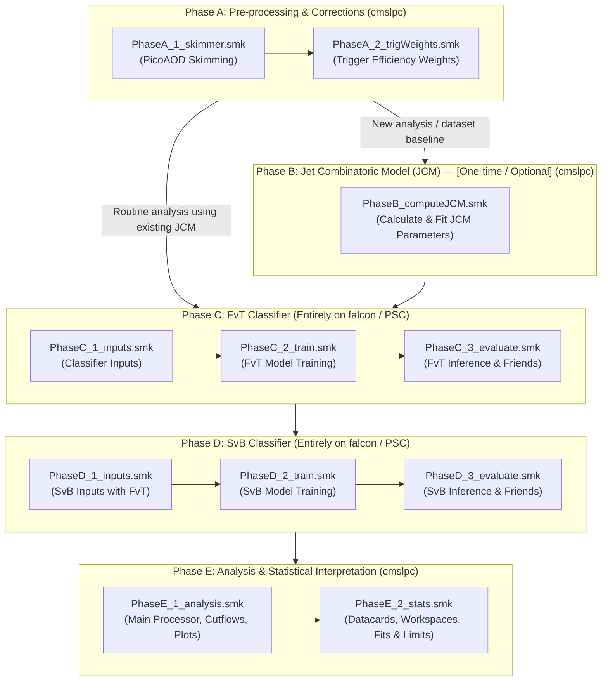
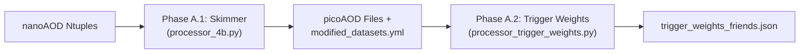
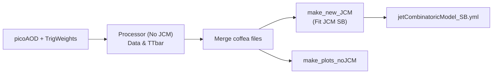
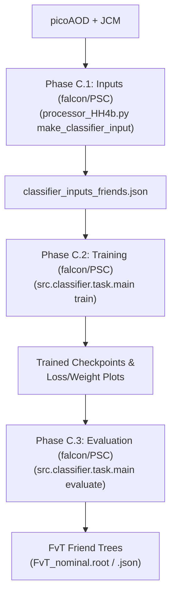
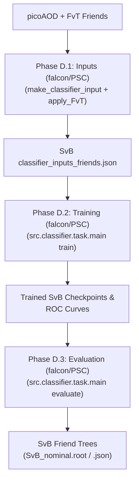
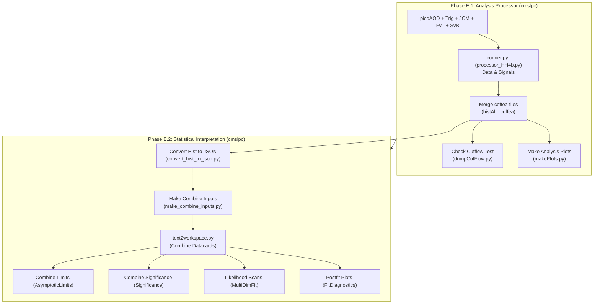
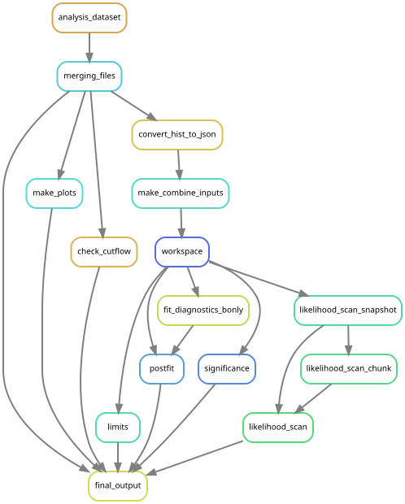

# Coffea4bees Analysis Workflows

This directory contains the Snakemake workflows orchestrated for the **HH $\to$ 4b** (and **ttH(bb)**) analysis pipelines in `coffea4bees`.

The pipeline is organized into modular **Phases (A through E)** reflecting the full analysis lifecycle, from raw nanoAOD ntuples to final Combine statistical interpretation and limit extraction.

---

## 1. Execution Environments & Target Machines

| Phase | Purpose | Target Execution Environment | Compute Requirements |
| :--- | :--- | :--- | :--- |
| **Phase A** | Skimmer & Trigger Weights | **`cmslpc`** | CPU (Condor / Dask batching) |
| **Phase B** | JCM Computation *(One-time / Initial)* | **`cmslpc`** | CPU (Multiprocessing / Dask) |
| **Phase C** | FvT Classifier (Inputs $\to$ Train $\to$ Evaluate) | **`falcon`** (GPU cluster) / **PSC Bridges-2** | GPU (NVIDIA MPS/CUDA for training & inference) |
| **Phase D** | SvB Classifier (Inputs $\to$ Train $\to$ Evaluate) | **`falcon`** (GPU cluster) / **PSC Bridges-2** | GPU (NVIDIA MPS/CUDA for training & inference) |
| **Phase E** | Analysis Processor & CMS Combine Stats | **`cmslpc`** | CPU (Condor + Dask + Combine container) |

> [!TIP]
> **Configuration Best Practice**: While Snakemake supports direct command-line parameter overrides (e.g. `--config dataset=ttHbb year=UL18`), the **recommended and reproducible approach** is to run workflows using a centralized YAML configuration file passed via `--configfile` (e.g. `--configfile coffea4bees/workflows/config/nominal_run2.yml` or `coffea4bees/workflows/config/analysis_ttHbb.yml`). CLI `--config` flags should only be used for temporary or targeted overrides (such as `--config test=true` or single-dataset evaluation).

---

## 2. High-Level Analysis Pipeline Architecture



---

## 3. Phase-by-Phase Technical Specification

### Phase A: Skimming & Trigger Weights
* **Target Machine:** **`cmslpc`** (CPU batching via HTCondor)
* **Coordinator:** `Snakefile_PhaseA.smk`
* **Sub-workflows:**
  * `Snakefile_PhaseA_1_skimmer.smk`: Runs `skimmer_4b.py` on nanoAOD datasets, applies baseline object selections, and writes skimmed picoAOD root files.
  * `Snakefile_PhaseA_2_trigWeights.smk`: Calculates trigger efficiency scale factors and outputs a trigger weights friend tree JSON.



#### Snakemake Rulegraph DAG:
<p align="center">
  
</p>

**Execution Examples (using recommended config file):**
```bash
# Run full Phase A (Skim + Trigger Weights) via config file on cmslpc
./run_container snakemake -s coffea4bees/workflows/Snakefile_PhaseA.smk \
    --configfile coffea4bees/workflows/config/analysis_ttHbb.yml

# Run only the skimmer
./run_container snakemake -s coffea4bees/workflows/Snakefile_PhaseA_1_skimmer.smk \
    --configfile coffea4bees/workflows/config/analysis_ttHbb.yml

# Run only trigger weights calculation
./run_container snakemake -s coffea4bees/workflows/Snakefile_PhaseA_2_trigWeights.smk \
    --configfile coffea4bees/workflows/config/analysis_ttHbb.yml
```

---

### Phase B: Jet Combinatoric Model (JCM) — *(One-time / Initial Calibration)*
* **Target Machine:** **`cmslpc`**
* **Workflow:** `Snakefile_PhaseB_computeJCM.smk` (also aliased by `Snakefile_computeJCM.smk`)
* **Note on Scope:** **Phase B is optional/one-off.** It is executed when setting up a new analysis or establishing a new dataset parameterization baseline. Once the JCM transfer function parameters (`jetCombinatoricModel_SB_<tag>.yml`) are fitted, they are stored and reused in subsequent analysis runs without needing to re-run Phase B every time.
* **Purpose:** Derives jet combinatoric model weights by running the Coffea processor with `apply_JCM: false` and fitting the resulting histograms to compute transfer factors between jet multiplicities.
* **Outputs:** `jetCombinatoricModel_SB_<tag>.yml` and validation plots.



#### Snakemake Rulegraph DAG:
<p align="center">
  
</p>

**Execution Examples:**
```bash
# Dry run
pixi run snakemake -s coffea4bees/workflows/Snakefile_PhaseB_computeJCM.smk \
    --configfile coffea4bees/workflows/config/analysis_ttHbb.yml \
    --config test=true \
    -n

# Run production JCM computation on cmslpc
./run_container snakemake -s coffea4bees/workflows/Snakefile_PhaseB_computeJCM.smk \
    --configfile coffea4bees/workflows/config/analysis_ttHbb.yml \
    --cores 4
```

---

### Phase C: FvT (Four-vs-Three) Classifier Pipeline
* **Target Machine:** **`falcon`** (GPU cluster) or **PSC Bridges-2** (Entire Phase: inputs, training, and evaluation)
* **Coordinator:** `Snakefile_PhaseC.smk`
* **Sub-workflows:**
  * `Snakefile_PhaseC_1_inputs.smk` (aliased by `Snakefile_make_classifier_friendtree.smk`): Generates input ROOT friend trees with event features and JCM weights for training.
  * `Snakefile_PhaseC_2_train.smk`: Trains multi-fold FvT neural networks using PyTorch/HCR, producing checkpoints and loss/weight diagnostics.
  * `Snakefile_PhaseC_3_evaluate.smk`: Evaluates trained models on datasets to produce FvT friend tree ntuples.



#### Snakemake Rulegraph DAG:
<p align="center">
  
</p>

**Execution Examples (on falcon / PSC):**
```bash
# Run full Phase C master pipeline on falcon / PSC
pixi run snakemake -s coffea4bees/workflows/Snakefile_PhaseC.smk \
    --configfile coffea4bees/classifier/config/workflows/HH4b_2024_v2/FvT/workflow_config.yml \
    --cores 8

# Run only classifier inputs generation
pixi run snakemake -s coffea4bees/workflows/Snakefile_PhaseC_1_inputs.smk \
    --configfile coffea4bees/workflows/config/nominal_run2.yml \
    --cores 8

# Run only training & diagnostic validation plots
pixi run snakemake -s coffea4bees/workflows/Snakefile_PhaseC_2_train.smk \
    --configfile coffea4bees/classifier/config/workflows/HH4b_2024_v2/FvT/workflow_config.yml \
    --cores 8

# Run evaluation on ALL datasets
pixi run snakemake -s coffea4bees/workflows/Snakefile_PhaseC_3_evaluate.smk \
    --configfile coffea4bees/classifier/config/workflows/HH4b_2024_v2/FvT/workflow_config.yml \
    --cores 8

# Run evaluation on a SINGLE dataset (e.g. ttHbb)
pixi run snakemake -s coffea4bees/workflows/Snakefile_PhaseC_3_evaluate.smk \
    --configfile coffea4bees/classifier/config/workflows/HH4b_2024_v2/FvT/workflow_config.yml \
    --config dataset=ttHbb \
    --cores 4
```

---

### Phase D: SvB (Signal-vs-Background) Classifier Pipeline
* **Target Machine:** **`falcon`** (GPU cluster) or **PSC Bridges-2** (Entire Phase: inputs, training, and evaluation)
* **Coordinator:** `Snakefile_PhaseD.smk`
* **Sub-workflows:**
  * `Snakefile_PhaseD_1_inputs.smk`: Generates SvB classifier inputs with FvT weights applied.
  * `Snakefile_PhaseD_2_train.smk`: Trains multiclass / binary SvB classifiers (e.g. HH4b vs ttbar/multijet, or ttHbb vs ttbar).
  * `Snakefile_PhaseD_3_evaluate.smk`: Evaluates trained SvB models across all analysis datasets.



#### Snakemake Rulegraph DAG:
<p align="center">
  
</p>

**Execution Examples (on falcon / PSC):**
```bash
# Run full Phase D master pipeline on falcon / PSC
pixi run snakemake -s coffea4bees/workflows/Snakefile_PhaseD.smk \
    --configfile coffea4bees/classifier/config/workflows/HH4b_2024_v2/SvB/workflow_config.yml \
    --cores 8

# Run only classifier inputs generation
pixi run snakemake -s coffea4bees/workflows/Snakefile_PhaseD_1_inputs.smk \
    --configfile coffea4bees/workflows/config/nominal_run2.yml \
    --cores 8

# Run only SvB training
pixi run snakemake -s coffea4bees/workflows/Snakefile_PhaseD_2_train.smk \
    --configfile coffea4bees/classifier/config/workflows/HH4b_2024_v2/SvB/workflow_config.yml \
    --cores 8

# Run SvB evaluation on a specific dataset or list of datasets
pixi run snakemake -s coffea4bees/workflows/Snakefile_PhaseD_3_evaluate.smk \
    --configfile coffea4bees/classifier/config/workflows/HH4b_2024_v2/SvB/workflow_config.yml \
    --config dataset=ttHbb \
    --cores 4
```

---

### Phase E: Analysis & Statistical Interpretation
* **Target Machine:** **`cmslpc`** (CPU batching with HTCondor/Dask + Combine container)
* **Coordinator:** `Snakefile_PhaseE.smk` (aliased by `Snakefile_full_analysis.smk`)
* **Sub-workflows:**
  * `Snakefile_PhaseE_1_analysis.smk` (aliased by `Snakefile_analysis.smk`): Runs main Coffea analysis processor (`processor_HH4b.py`), merges histogram files, checks cutflow agreement against reference files, and generates data/MC comparison plots.
  * `Snakefile_PhaseE_2_stats.smk` (aliased by `Snakefile_stats.smk`): Converts histogram distributions to Combine JSON format, generates CMS Combine datacards, builds workspaces, and computes expected limits, signal significance, and likelihood profile scans.



#### Snakemake Rulegraph DAG:
<p align="center">
  
</p>

**Execution Examples (on cmslpc):**
```bash
# Run full Phase E (Analysis + Stats) on cmslpc
./run_container snakemake -s coffea4bees/workflows/Snakefile_PhaseE.smk \
    --configfile coffea4bees/workflows/config/nominal_run2.yml \
    --cores 16

# Run only Phase E.1 Analysis processor & plotting
./run_container snakemake -s coffea4bees/workflows/Snakefile_PhaseE_1_analysis.smk \
    --configfile coffea4bees/workflows/config/nominal_run2.yml \
    --cores 16

# Run only Phase E.2 Combine statistical fits
./run_container snakemake -s coffea4bees/workflows/Snakefile_PhaseE_2_stats.smk \
    --configfile coffea4bees/workflows/config/nominal_run2.yml \
    --cores 8
```

---

## 4. General Running Guide & Common Options

### Local & Dry-Run Mode
Always dry-run (`-n` or `-np`) before launching large jobs:
```bash
pixi run snakemake -s coffea4bees/workflows/Snakefile_PhaseE_1_analysis.smk \
    --configfile coffea4bees/workflows/config/analysis_ttHbb.yml \
    --config test=true \
    -np
```

### Distributed Execution (Condor & Dask on cmslpc)
For full-scale analysis runs on `cmslpc`, run within the container wrapper using Condor and Dask batching:
```bash
./run_container snakemake -s coffea4bees/workflows/Snakefile_PhaseE.smk \
    --configfile coffea4bees/workflows/config/nominal_run2.yml \
    --cores 16
```

### Generating Snakemake DAG & Rulegraph Visualizations
To generate the visual DAG diagram for any phase locally:
```bash
# Generate SVG rulegraph
pixi run snakemake -s coffea4bees/workflows/Snakefile_PhaseA.smk \
    --configfile coffea4bees/workflows/config/analysis_ttHbb.yml \
    --rulegraph | dot -Tsvg -o rulegraph_PhaseA.svg

# Generate full detailed job DAG
pixi run snakemake -s coffea4bees/workflows/Snakefile_PhaseE_1_analysis.smk \
    --configfile coffea4bees/workflows/config/analysis_ttHbb.yml \
    --config test=true \
    --dag | dot -Tpng -o job_dag_PhaseE1.png
```

### Backwards Compatibility
Existing legacy workflow entry points are preserved as thin wrappers:
* `Snakefile_computeJCM.smk` $\to$ includes `Snakefile_PhaseB_computeJCM.smk`
* `Snakefile_make_classifier_friendtree.smk` $\to$ includes `Snakefile_PhaseC_1_inputs.smk`
* `Snakefile_analysis.smk` $\to$ includes `Snakefile_PhaseE_1_analysis.smk`
* `Snakefile_stats.smk` $\to$ includes `Snakefile_PhaseE_2_stats.smk`
* `Snakefile_full_analysis.smk` $\to$ includes `Snakefile_PhaseE.smk`

Legacy standalone exploratory files (e.g. `Snakefile_lowpt.smk`, `Snakefile_combinations_ZZ_ZH.smk`, `Snakefile_ZZ_ZH.smk`, `Snakefile_addingVBF.smk`) have been archived into `coffea4bees/workflows/archive/`.
