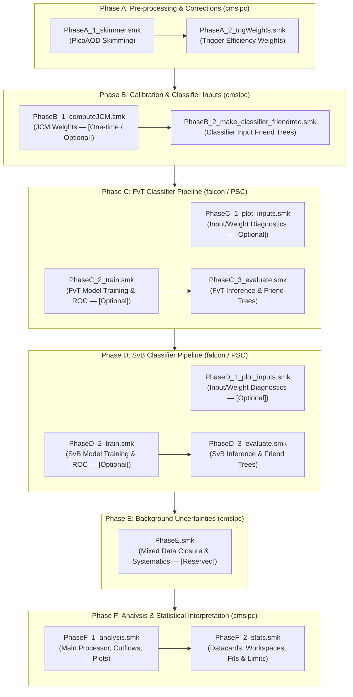

# Coffea4bees Analysis Workflows

This directory contains the Snakemake workflows orchestrated for the **HH $\to$ 4b** (and **ttH(bb)**) analysis pipelines in `coffea4bees`.

The pipeline is organized into modular **Phases (A through F)** reflecting the full analysis lifecycle, from raw nanoAOD ntuples to final Combine statistical interpretation and limit extraction.

---

## 1. Execution Environments & Target Machines

| Phase | Purpose | Target Execution Environment | Compute Requirements |
| :--- | :--- | :--- | :--- |
| **Phase A** | Skimmer & Trigger Weights | **`cmslpc`** | CPU (Condor / Dask batching) |
| **Phase B** | Calibration (JCM) & Classifier Input Friendtrees | **`cmslpc`** | CPU (Condor / Dask batching) |
| **Phase C** | FvT Classifier (Plot Inputs $\to$ Train $\to$ Evaluate) | **`falcon`** (GPU cluster) / **PSC Bridges-2** | GPU (NVIDIA MPS/CUDA for training & inference) |
| **Phase D** | SvB Classifier (Plot Inputs $\to$ Train $\to$ Evaluate) | **`falcon`** (GPU cluster) / **PSC Bridges-2** | GPU (NVIDIA MPS/CUDA for training & inference) |
| **Phase E** | Background Uncertainties *(Reserved for Mixed Data)* | **`cmslpc`** | CPU (Condor / Dask batching) |
| **Phase F** | Analysis Processor & CMS Combine Stats | **`cmslpc`** | CPU (Condor + Dask + Combine container) |

> [!TIP]
> **Configuration Best Practice**: While Snakemake supports direct command-line parameter overrides (e.g. `--config dataset=ttHbb year=UL18`), the **recommended and reproducible approach** is to run workflows using a centralized YAML configuration file passed via `--configfile` (e.g. `--configfile coffea4bees/workflows/config/nominal_run2.yml` or `coffea4bees/workflows/config/analysis_ttHbb.yml`). CLI `--config` flags should only be used for temporary or targeted overrides (such as `--config test=true` or single-dataset evaluation).

---

## 2. High-Level Analysis Pipeline Architecture



---

## 3. Phase-by-Phase Technical Specification

### Phase A: Skimming & Trigger Weights
* **Target Machine:** **`cmslpc`** (CPU batching via HTCondor)
* **Coordinator:** `Snakefile_PhaseA.smk`
* **Sub-workflows:**
  * `Snakefile_PhaseA_1_skimmer.smk`: Runs `skimmer_4b.py` on nanoAOD datasets, applies baseline object selections, and writes skimmed picoAOD root files.
  * `Snakefile_PhaseA_2_trigWeights.smk`: Calculates trigger efficiency scale factors and outputs a trigger weights friend tree JSON.

#### Snakemake Rulegraph DAG:
<p align="center">
  
</p>

**Execution Examples (using recommended config file):**
```bash
# Run full Phase A (Skim + Trigger Weights) via config file on cmslpc
./run_container snakemake -s coffea4bees/workflows/Snakefile_PhaseA.smk \
    --configfile coffea4bees/workflows/config/analysis_ttHbb.yml

# Run only the skimmer
./run_container snakemake -s coffea4bees/workflows/Snakefile_PhaseA_1_skimmer.smk \
    --configfile coffea4bees/workflows/config/analysis_ttHbb.yml

# Run only trigger weights calculation
./run_container snakemake -s coffea4bees/workflows/Snakefile_PhaseA_2_trigWeights.smk \
    --configfile coffea4bees/workflows/config/analysis_ttHbb.yml
```

---

### Phase B: Calibration & Classifier Input Preparation
* **Target Machine:** **`cmslpc`**
* **Coordinator:** `Snakefile_PhaseB.smk`
* **Sub-workflows:**
  * `Snakefile_PhaseB_1_computeJCM.smk` (aliased by `Snakefile_computeJCM.smk`): *(One-time / Initial Calibration)* Derives jet combinatoric model weights by running the Coffea processor with `apply_JCM: false` and fitting the resulting histograms to compute transfer factors between jet multiplicities.
  * `Snakefile_PhaseB_2_make_classifier_friendtree.smk` (aliased by `Snakefile_make_classifier_friendtree.smk`): Runs the Coffea processor (`processor_HH4b.py make_classifier_input`) on datasets to create the ROOT friend tree files used as input features for classifier training and evaluation.

#### Snakemake Rulegraph DAG:
<p align="center">
  
</p>

**Execution Examples (on cmslpc):**
```bash
# Run full Phase B (JCM + Classifier Inputs) on cmslpc
./run_container snakemake -s coffea4bees/workflows/Snakefile_PhaseB.smk \
    --configfile coffea4bees/workflows/config/analysis_ttHbb.yml \
    --cores 8

# Run only Phase B.1 JCM computation
./run_container snakemake -s coffea4bees/workflows/Snakefile_PhaseB_1_computeJCM.smk \
    --configfile coffea4bees/workflows/config/analysis_ttHbb.yml \
    --cores 4

# Run only Phase B.2 Classifier friend tree inputs creation
./run_container snakemake -s coffea4bees/workflows/Snakefile_PhaseB_2_make_classifier_friendtree.smk \
    --configfile coffea4bees/workflows/config/analysis_ttHbb.yml \
    --cores 8
```

---

### Phase C: FvT (Four-vs-Three) Classifier Pipeline
* **Target Machine:** **`falcon`** (GPU cluster) or **PSC Bridges-2** (Entire Phase on GPU)
* **Coordinator:** `Snakefile_PhaseC.smk`
* **Sub-workflows:**
  * `Snakefile_PhaseC_1_plot_inputs.smk`: *(Optional)* Generates raw feature distributions, preprocessed data distributions, and learned event weights plots (`plot_inputs_raw`, `plot_inputs_dataprep`, `plot_weights`).
  * `Snakefile_PhaseC_2_train.smk`: *(Optional when retraining)* Trains multi-fold FvT neural networks using PyTorch/HCR (`train`) and produces training loss and ROC curve diagnostics (`analyze`).
  * `Snakefile_PhaseC_3_evaluate.smk`: Evaluates trained models on datasets to produce FvT friend tree ntuples (`evaluate`). Flexible to run standalone or chained after training.

#### Snakemake Rulegraph DAG:
<p align="center">
  
</p>

**Execution Examples (on falcon / PSC):**
```bash
# Run full Phase C master pipeline
pixi run snakemake -s coffea4bees/workflows/Snakefile_PhaseC.smk \
    --configfile coffea4bees/workflows/config/analysis_ttHbb.yml \
    --cores 8

# Run only Phase C.1 Diagnostic plotting
pixi run snakemake -s coffea4bees/workflows/Snakefile_PhaseC_1_plot_inputs.smk \
    --configfile coffea4bees/workflows/config/analysis_ttHbb.yml \
    --cores 4

# Run only Phase C.2 Model training & loss/ROC analysis
pixi run snakemake -s coffea4bees/workflows/Snakefile_PhaseC_2_train.smk \
    --configfile coffea4bees/workflows/config/analysis_ttHbb.yml \
    --cores 8

# Run Phase C.3 evaluation on ALL datasets
pixi run snakemake -s coffea4bees/workflows/Snakefile_PhaseC_3_evaluate.smk \
    --configfile coffea4bees/workflows/config/analysis_ttHbb.yml \
    --cores 8

# Run Phase C.3 evaluation on a SINGLE dataset (e.g. ttHbb)
pixi run snakemake -s coffea4bees/workflows/Snakefile_PhaseC_3_evaluate.smk \
    --configfile coffea4bees/workflows/config/analysis_ttHbb.yml \
    --config dataset=ttHbb \
    --cores 4
```

---

### Phase D: SvB (Signal-vs-Background) Classifier Pipeline
* **Target Machine:** **`falcon`** (GPU cluster) or **PSC Bridges-2** (Entire Phase on GPU)
* **Coordinator:** `Snakefile_PhaseD.smk`
* **Sub-workflows:**
  * `Snakefile_PhaseD_1_plot_inputs.smk`: *(Optional)* Generates raw and preprocessed feature distributions and weight plots.
  * `Snakefile_PhaseD_2_train.smk`: *(Optional when retraining)* Trains multiclass / binary SvB classifiers (`train`) and generates ROC curves (`analyze`).
  * `Snakefile_PhaseD_3_evaluate.smk`: Evaluates trained SvB models across analysis datasets to generate SvB friend tree ntuples (`evaluate`).

#### Snakemake Rulegraph DAG:
<p align="center">
  
</p>

**Execution Examples (on falcon / PSC):**
```bash
# Run full Phase D master pipeline
pixi run snakemake -s coffea4bees/workflows/Snakefile_PhaseD.smk \
    --configfile coffea4bees/workflows/config/analysis_ttHbb.yml \
    --cores 8

# Run only Phase D.1 Diagnostic plotting
pixi run snakemake -s coffea4bees/workflows/Snakefile_PhaseD_1_plot_inputs.smk \
    --configfile coffea4bees/workflows/config/analysis_ttHbb.yml \
    --cores 4

# Run only Phase D.2 SvB training & analysis
pixi run snakemake -s coffea4bees/workflows/Snakefile_PhaseD_2_train.smk \
    --configfile coffea4bees/workflows/config/analysis_ttHbb.yml \
    --cores 8

# Run Phase D.3 SvB evaluation on a specific dataset or list of datasets
pixi run snakemake -s coffea4bees/workflows/Snakefile_PhaseD_3_evaluate.smk \
    --configfile coffea4bees/workflows/config/analysis_ttHbb.yml \
    --config dataset=ttHbb \
    --cores 4
```

---

### Phase E: Background Uncertainties & Systematics
* **Target Machine:** **`cmslpc`**
* **Coordinator:** `Snakefile_PhaseE.smk`
* **Note:** Reserved for mixed data background model closure, hemisphere mixing, and transfer factor systematic uncertainty derivations.

---

### Phase F: Analysis & Statistical Interpretation
* **Target Machine:** **`cmslpc`** (CPU batching with HTCondor/Dask + Combine container)
* **Coordinator:** `Snakefile_PhaseF.smk` (aliased by `Snakefile_full_analysis.smk`)
* **Sub-workflows:**
  * `Snakefile_PhaseF_1_analysis.smk` (aliased by `Snakefile_analysis.smk`): Runs main Coffea analysis processor (`processor_HH4b.py`), merges histogram files, checks cutflow agreement against reference counts, and generates data/MC comparison plots.
  * `Snakefile_PhaseF_2_stats.smk` (aliased by `Snakefile_stats.smk`): Converts histogram distributions to Combine JSON format, generates CMS Combine datacards, builds workspaces, and computes expected limits, signal significance, and likelihood profile scans.

#### Snakemake Rulegraph DAG:
<p align="center">
  
</p>

**Execution Examples (on cmslpc):**
```bash
# Run full Phase F (Analysis + Stats) on cmslpc
./run_container snakemake -s coffea4bees/workflows/Snakefile_PhaseF.smk \
    --configfile coffea4bees/workflows/config/nominal_run2.yml \
    --cores 16

# Run only Phase F.1 Analysis processor & plotting
./run_container snakemake -s coffea4bees/workflows/Snakefile_PhaseF_1_analysis.smk \
    --configfile coffea4bees/workflows/config/nominal_run2.yml \
    --cores 16

# Run only Phase F.2 Combine statistical fits
./run_container snakemake -s coffea4bees/workflows/Snakefile_PhaseF_2_stats.smk \
    --configfile coffea4bees/workflows/config/nominal_run2.yml \
    --cores 8
```

---

## 4. General Running Guide & Common Options

### Local & Dry-Run Mode
Always dry-run (`-n` or `-np`) before launching large jobs:
```bash
pixi run snakemake -s coffea4bees/workflows/Snakefile_PhaseF_1_analysis.smk \
    --configfile coffea4bees/workflows/config/analysis_ttHbb.yml \
    --config test=true \
    -np
```

### Backwards Compatibility
Existing legacy workflow entry points are preserved as thin wrappers:
* `Snakefile_computeJCM.smk` $\to$ includes `Snakefile_PhaseB_1_computeJCM.smk`
* `Snakefile_make_classifier_friendtree.smk` $\to$ includes `Snakefile_PhaseB_2_make_classifier_friendtree.smk`
* `Snakefile_analysis.smk` $\to$ includes `Snakefile_PhaseF_1_analysis.smk`
* `Snakefile_stats.smk` $\to$ includes `Snakefile_PhaseF_2_stats.smk`
* `Snakefile_full_analysis.smk` $\to$ includes `Snakefile_PhaseF.smk`

Legacy standalone exploratory files (e.g. `Snakefile_lowpt.smk`, `Snakefile_combinations_ZZ_ZH.smk`, `Snakefile_ZZ_ZH.smk`, `Snakefile_addingVBF.smk`) have been archived into `coffea4bees/workflows/archive/`.
